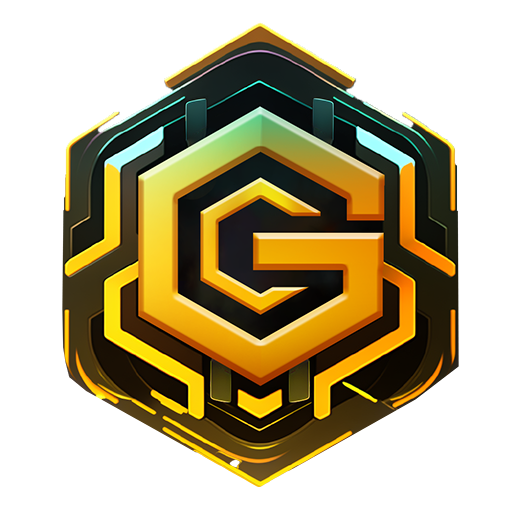

# ✉ Introduction

GPTOSHI AI is a revolutionary new crypto project focused on delivering innovative AI-powered solutions on the Binance Smart Chain. The project is community-driven and seeks to deliver real value to users through the creation of AI-powered Dapps.

<figure><figcaption>
GPTOSHI - AI
</figcaption></figure>

The world of AI is rapidly evolving, with new and exciting applications being developed every day. However, many of these solutions are still inaccessible to the average user due to their complexity and cost. GPTOSHI AI aims to change that by providing a decentralized platform for AI that is accessible and easy to use for everyone.

The project is currently focused on three main areas: image generation, code generation, and AI-powered Dapps. By enabling users to quickly and easily generate images and code using the power of AI, GPTOSHI AI is creating new opportunities for creativity and innovation. In addition, the project is working on developing a range of AI-powered Dapps that will enable new and exciting use cases for users.

GPTOSHI AI has chosen to build on the Binance Smart Chain due to its fast and low-cost transactions, as well as the vast ecosystem of DeFi applications and services available on the chain. This means that users will be able to take advantage of existing solutions to easily trade and interact with GPTOSHI AI tokens.

The GPTOSHI AI team is made up of experienced professionals with a track record of delivering successful projects in the AI experts, and business professionals with experience in finance and marketing. The team is committed to delivering real value to users and ensuring that the project remains community-driven.

At its core, GPTOSHI AI is a project that aims to bring the benefits of AI to the masses. By providing a decentralized platform for AI that is easy to use and accessible to everyone, the project is opening up new opportunities for creativity and innovation. With a focus on image generation, code generation, and AI-powered Dapps, GPTOSHI AI is well-positioned to become a leading force in the world of AI on the Binance Smart Chain.

Investing in GPTOSHI AI offers a unique opportunity to be a part of a project that has the potential to make a real difference in the world. The project's commitment to innovation and community-driven development ensures that it will continue to create value for its users and the wider blockchain community.

In conclusion, GPTOSHI AI is a promising project that has the potential to revolutionize the world of AI on the blockchain. With its focus on accessibility, innovation, and collaboration, the project is well-positioned to become a major player in the space. By investing in GPTOSHI AI, users can be a part of this exciting new venture and help shape the future of AI on the blockchain.
