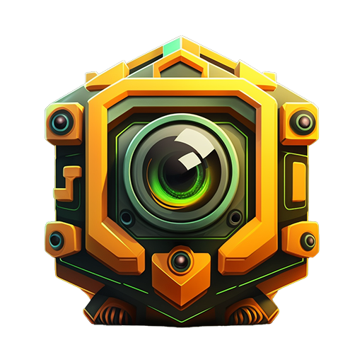

# 📷 GPTOSHI-AI Image Generation

<figure><figcaption>
GPTOSHI_BOT
</figcaption></figure>

GPTOSHI AI's image generation capabilities are currently available as a Telegram bot, which is a beta product. However, the team is working on expanding this capability to other platforms, including a web version of the image generator. One of the new features in development is the ability to generate NFT collectibles from the images created on the platform. This will allow users to easily monetize their creations and take advantage of the growing NFT market. The advantages of GPTOSHI AI's image generation capabilities include:

* Quick and easy image generation using the power of AI.
* A wide variety of styles and themes to choose from.
* A decentralized platform that puts users in control of their creations.
* The ability to easily generate unique and interesting images for personal or commercial use.
