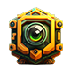

# Generating NFT Collectibles with Image Generation:

One of the most exciting aspects of the GPTOSHI-AI image generation feature is the ability to generate unique and original NFT collectibles from the images created on the platform. This provides a new way for artists and creators to monetize their digital creations, and it is a unique intersection of art and technology that has the potential to revolutionize the art market.

In conclusion, GPTOSHI-AI Image Generation is an innovative and community-driven project that provides a unique opportunity for users to explore the power of AI in image creation on the blockchain. With its focus on accessibility, innovation, collaboration, and monetization, the platform is committed to delivering real value to users and is a unique and exciting investment opportunity.

<figure><figcaption></figcaption></figure>

\
